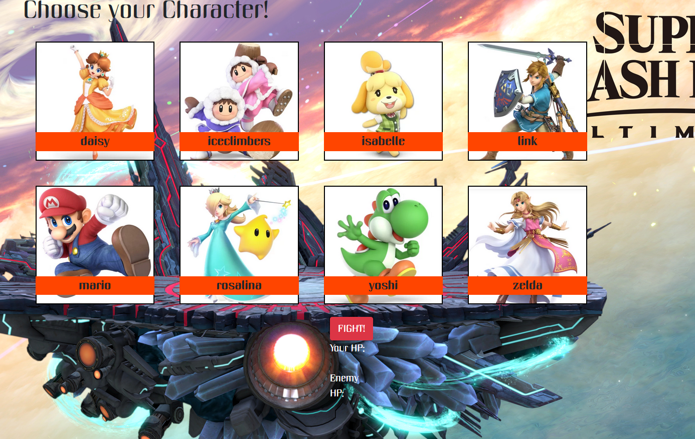
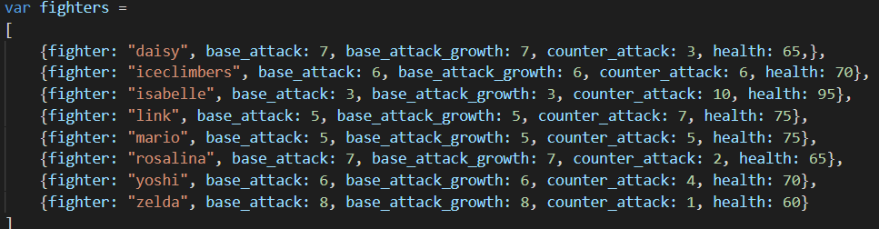
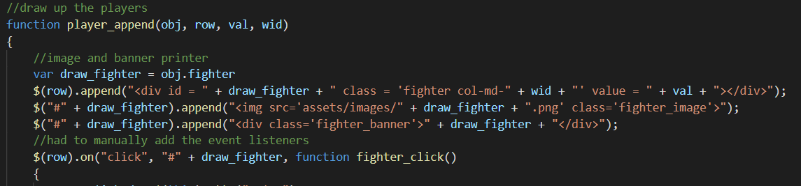
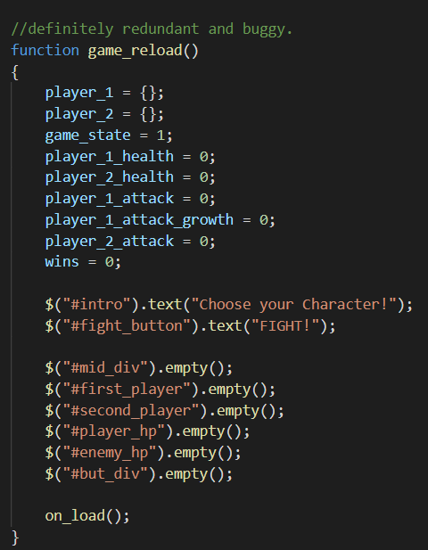

# RolePlayGame
A themed fight the enemy simulator

time for the big leagues. larger than average sized leagues? little more than medicore stature leagues?

the code's somewhat buggy but I managed to cut it down to two bugs.
1. upon restarting the game sets both player 1 and player 2 as whatever was first clicked, and it is possible to win without defeating everybody.

2. when an enemy is dead and you're selecting a new enemy it's possible to selet yourself.

here's some cool code.

I love arrays of objects

this is where the magic happens. condensing many lines of code down to a single function with a few too many inputs but that's ok.

here's what I think is the source of my woes. it (tries) to reset the game.

and here's the beaute in action. ignore the different backgrounds I didn't have time to redo this part.
